# Welcome to Wobblin' Goblin
It's nice to meet you.

* If you're player you can skip to [creating an account](#creating-an-account).
* If you're a developer you can skip to [creating a server](#creating-a-server).
* If you're an experienced developer and have a working Docker installation you can skip to [starting the server](#starting-the-server).

## Our goals
> Reverse-engineered from the inputs and outputs of clients of popular multiplayer online role playing games such as World of Warcraft, an MMO framework or core emulates the server in the relationship between the client and server in an online game. Open source emulators give the user the freedom to run, study, change, and improve their own server.

* Tutorials for running, studying, changing, and improving our emulators.
* Central authentication that allows a public realm list to register our emulators.
* A community to support you in your studies as you gain a useful skill set.
* Open source and free forever (as in speech and beer).

## About us
Wobblin’ Goblin is a community where we play games and make fun things. If you're a developer you'll learn about programming, system administration, and databases amongst other things. While developing your emulator you get to play with others while you learn. We also need players to test the emulators the developers have made so there's a role for everyone.

## Creating an account
```shell
/account create <username> <password> <password>
```

```shell
set realmlist logon.wobgob.org
```

You can create a Wobblin' Goblin account on [Discord](https://discord.gg/rqq33HmMyX). Direct message Winzig to create an account.

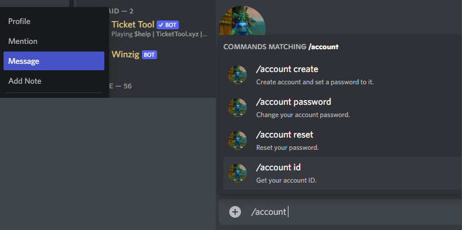

You'll also want to set the realm list for your client in `Data/enUS/realmlist.wtf`.

<aside class="success">
  If you're a player, you're done!
</aside>

<aside class="notice">
  If you're a developer, you've got a few extra steps before you can start playing.
</aside>

# Creating a server
> Think of Docker as running a computer inside a computer.

> A virtual private server (or VPS) is a server that someone else hosts for you. This has the advantage of maximizing uptime of your server as that's the hosting provider's job. If you hosted at home you'd have to contend with power outages and loss of internet.

It's easier to run a server using Linux than other operating systems. Getting Docker working on Windows can be a headache so we'll be renting a virtual private server from a hosting provider.

We'll be using [Vultr](https://www.vultr.com/) in this tutorial but most major hosting providers will be similar.

## Signing up
The first thing you'll want to do is to sign up with your hosting provider. You can get $50 free credit with Vultr by going to [https://www.vultr.com/promo/try50/](https://www.vultr.com/promo/try50/).

## Deploying a server
You'll then be redirected to [https://my.vultr.com/](https://my.vultr.com/). At this point you'll want to deploy a server.

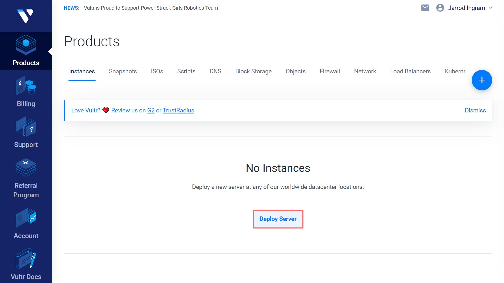

## Server type
> Our servers are incredibly memory hungry which is why you want to focus on increasing your memory if the server is suffering performance issues.

After you've chosen to deploy a server you'll have to choose the type of server. A regular server is fine for our purposes. As you grow you can choose different types of servers which are memory-optimized.

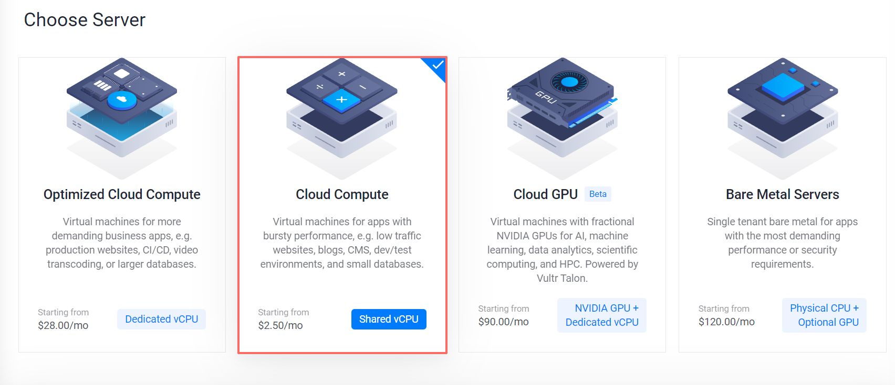

## CPU & Storage
While not particularly important because our servers are mostly memory bound, you can pick a CPU and storage type here.

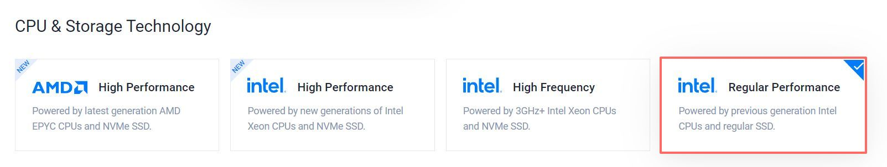

## Server location
The server's location is incredibly important so you and your player base have low latency. It's suggested you choose a location near you.

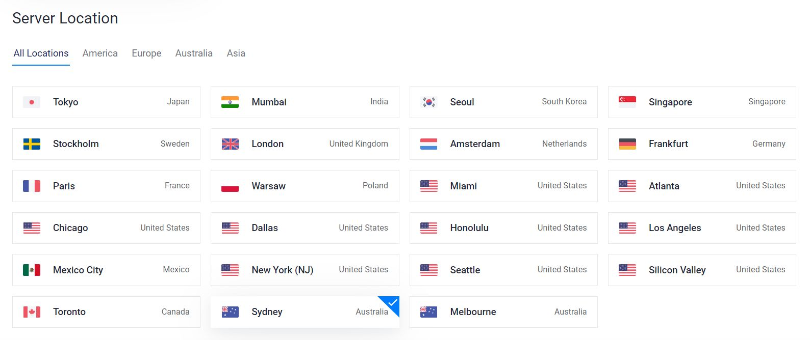

## Server image
It's suggested you use a Docker image. Those using Vultr will want to pick Ubuntu 20.04 x64 as the operating system type for the Docker image.

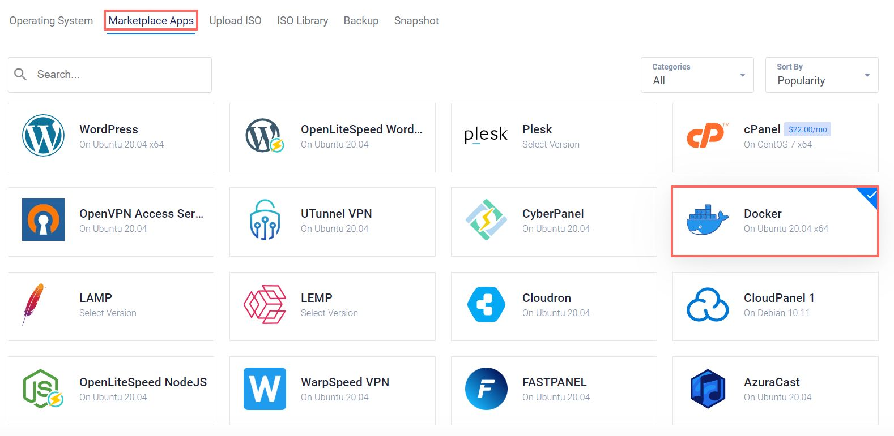

## Server size
Server size typically determines the storage, number of CPUs, memory, bandwidth, and the majority of the price of your server. We require at least 4 gigabyte of memory so we'll go for that option.

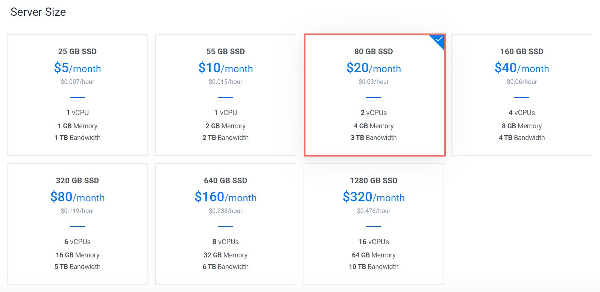

## Auto backups
We highly recommend enabling auto backups for any server that isn't throwaway. This will cost you 20% of the price.

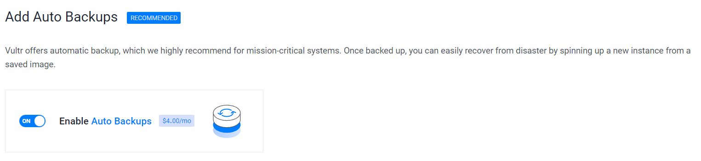

## Additional features
> If you know what SSH keys are you can add one here and use it to log into your root account.

Don't worry about any of the additional features and keep them at the default.

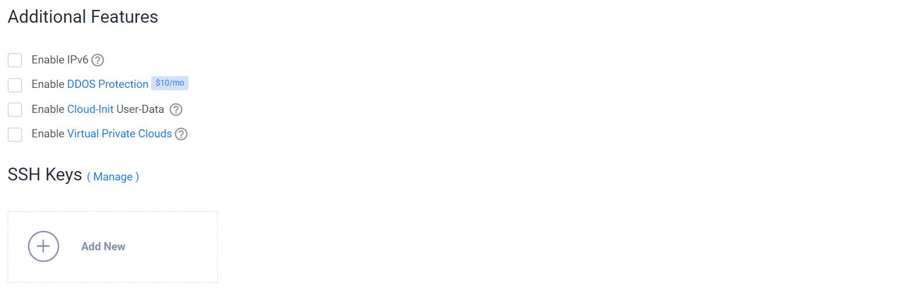

## Hostname & Price
> Hostnames are domains, where a domain is a hierarchical, dot-separated list of subdomains; for example, the machine `broken`, in the `wobgob` subdomain of the `org` domain would be represented as `broken.wobgob.org`.

<q>There are only two hard things in Computer Science: cache invalidation and naming things.</q>
– Phil Karlton

You'll have to think up a hostname for your server. To help with thinking up a name there's <a target="_blank" href="https://wobgob.org/mnemonics/">Wobblin' Goblin's Mnemonics</a>. You can also include a domain name in your hostname. If you need a domain you can use [Google Domains](https://domains.google/) or any other domain name registrar.

<aside class="notice">
  You don't need to register a domain name to use it in a hostname but it is recommended.
</aside>

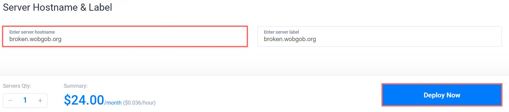

Given our specifications the price of the server is standard. Note that you usually don't pay for a month upfront but rather in hourly increments.

<aside class="success">
  Hit "Deploy Now" and your server will start installing.
</aside>

# Starting the emulator
After you server is installed its status will be set to "Running" and you'll be able to click on it.

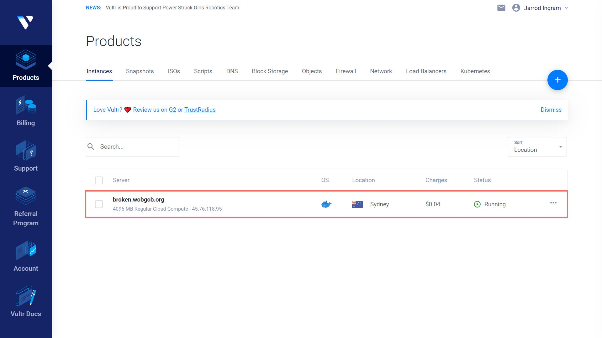

However, the server is not running the emulator yet which we installed Docker to use. To do that first we'll need the server's address and password.

## Address & Password
When you open your instance you'll be confronted by a server overview. There's no need to panic though as we only need the IP address, username, and password.

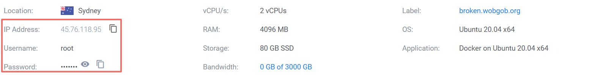

<aside class="notice">
  Note down the IP address, username, and password because you'll need them later to log into the server.
</aside>

## OpenSSH
Our beginner development environment is comprised of an OpenSSH client and Visual Studio Code with the Remote SSH extension which is the basis for a more advanced development environment.

### Windows
To install the OpenSSH client first open **Settings**, select **Apps** > **Apps & Features**, then select **Optional Features**.

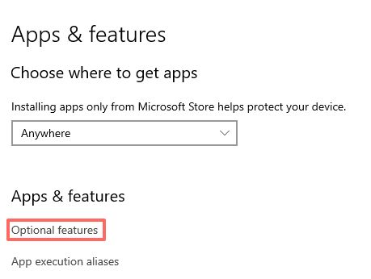

Search the list for `openssh` to see if the OpenSSH client is already installed. If not, at the top of the page, select **Add a feature**.

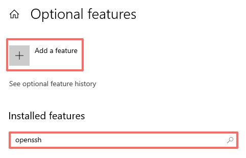

Find the **OpenSSH Client**, then click **Install**.

<aside class="warning">
  Do not install the OpenSSH server if you don't know what you're doing because it's a security risk.
</aside>

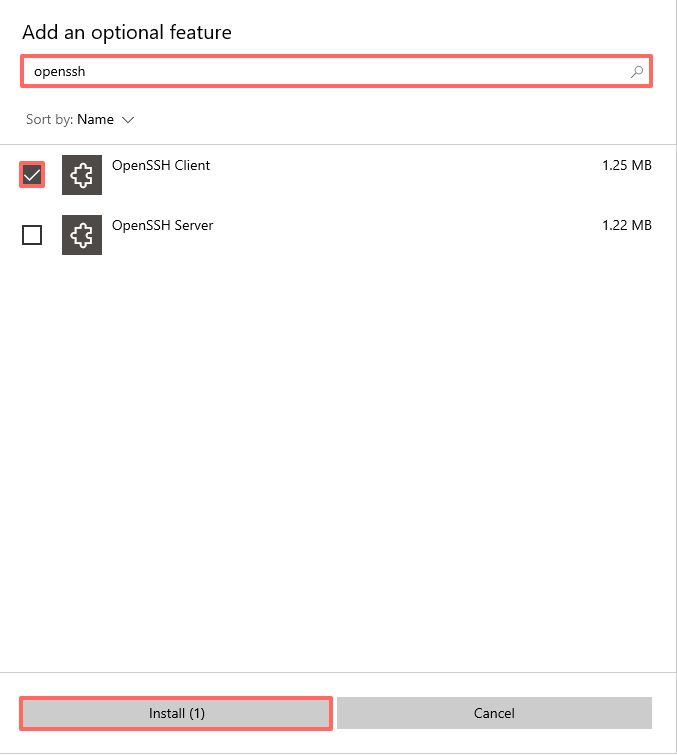

### macOS
macOS comes with an OpenSSH client.

### Linux
```shell
# Debian and Ubuntu
sudo apt install openssh-client

# Arch Linux and Manjaro
sudo pacman -S openssh

# OpenSUSE
sudo zypper install openssh

# Fedora
sudo dnf install -y openssh-clients
```

In Linux you can run a command from the terminal to install the OpenSSH client.

## Visual Studio Code
> An integrated development environment (IDE) is software for building other software. It provides a single graphical user interface (GUI) for a source code editor, build automation, and debugger.

Visual Studio Code will be our first integrated development environment (IDE) that you'll be using for its file manager and terminal for now. We'll need Visual Studio Code with the Remote SSH extension to do our work. The Remote SSH extension is used to connect to  SSH hosts which our server is one.

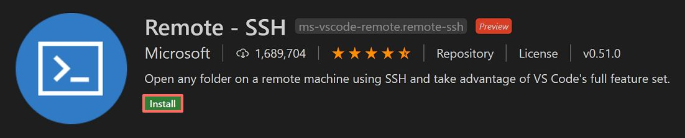

### Windows
Install <a target="_blank" href="https://code.visualstudio.com">Visual Studio Code</a>. It is a standard installer and should be easy enough to install. Then <a href="vscode:extension/ms-vscode-remote.remote-ssh">install the Remote SSH extension</a>.

### macOS
Follow the setup instructions at <a target="_blank" href="https://code.visualstudio.com/docs/setup/mac">Visual Studio Code on macOS</a>. Then <a href="vscode:extension/ms-vscode-remote.remote-ssh">install the Remote SSH extension</a>.

### Linux
Follow the setup instructions for your distribution at <a target="_blank" href="https://code.visualstudio.com/docs/setup/linux">Visual Studio Code on Linux</a>. Then <a href="vscode:extension/ms-vscode-remote.remote-ssh">install the Remote SSH extension</a>.

## Connecting to the server
> If you used an SSH key you wouldn't be prompted for your password. To learn more about setting up an SSH key consult <a target="_blank" href="https://docs.github.com/en/authentication/connecting-to-github-with-ssh/generating-a-new-ssh-key-and-adding-it-to-the-ssh-agent">Generating a new SSH key and adding it to the ssh-agent</a>.

With the Remote SSH extension installed, you will see a new status bar item on the far left.

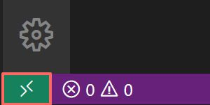

The remote status bar item can quickly show you in which context VS Code is running (local or remote) and clicking on the item will bring up the Remote SSH commands.

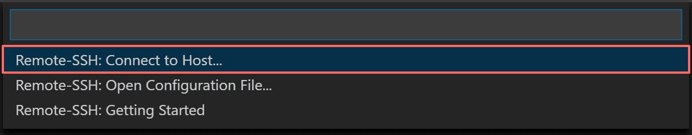

In VS Code, select **Remote-SSH: Connect to Host...** from the Command Palette (`F1`, `Ctrl+Shift+P`) and enter `<username>@<address>` where `<username>` and `<address>` are the username and IP address you noted down from your hosting provider previously. In our case the username was `root` and the IP address was `45.76.118.95` so we'd enter `root@45.76.118.95`.

<aside class="success">
  Enter your password that you noted down previously and you're connected!
</aside>

<aside class="notice">
  Choose Linux as the host's operating system if prompted.
</aside>

The status bar on the far left should have changed to indicate you're connected to your server. Next you'll want to open up a terminal so we can start the emulator.

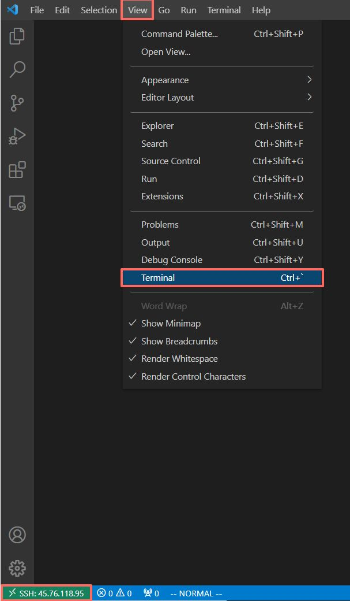

You should now be presented with a prompt such as `root@broken:~#`.

## Starting the server
```shell
# Enter the following into your terminal at the prompt.
pip3 install docker-compose

# Downloads a file describing the server.
wget https://wobgob.org/docker-compose.yml

# Start the server.
docker-compose up -d
```

Don't worry about understanding the commands yet, we'll be exploring the shell and terminal further in another tutorial.

## Accessing the server
```shell
# Access the server's console.
docker attach root_server_1

# Create an account.
account create <username> <password>

# Make it a game master account.
account set gmlevel <username> 3 -1
```

Once the server has initialized you can access your world server. To detach when you're finished press `Ctrl+P` then `Ctrl+Q`. Once you're at the server's console enter the account creation command and elevate that account to be a game master.

## Client setup
```shell
set realmlist <address> # Where <address> is the IP address you used earlier.
```

Modify your `Data/enUS/realmlist.wtf` file so you can connect to your server.

<aside class="success">
  That's it! Fire up your client and log in using the username and password that you used when creating your account.
</aside>

# What now?
Play around a bit. Invite your friends! Think of ways you could change or improve the emulator to better suit your playstyle. It helps to have some way to register accounts for example.

Currently we're working on tutorials for running, studying, changing, and improving our emulators. Make sure you've joined the [Discord](https://discord.gg/rqq33HmMyX) and followed us on [Twitter](https://twitter.com/wobgoborg) to stay up to date.
